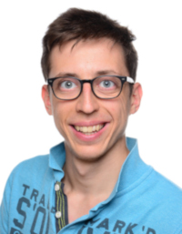

 

My name is Darius Rückert, I am 26 years old, and living in the beautiful city Erlangen (Germany). Since March 2018 I am full-time PhD student at the Visual Computing Lab of the Friedrich Alexander University Erlangen-Nürnberg (FAU). My main ressearch topics are 3D reconstruction, SLAM, real-time rendering, and optimization. 

## Active Projects

 * Implementing and integrating a code generator for templated cost-functors into ceres. [Gerrit](https://ceres-solver-review.googlesource.com/q/status:open), [Ceres](http://ceres-solver.org/) 
 * FragmentFusion: A light-weight SLAM pipeline for dense reconstruction. [Paper](paper/FragmentFusion.pdf) [Video](https://www.youtube.com/watch?v=DK7tvu2nw24)
 * Snake-SLAM. A sparse indirect SLAM system for real-time camera localization. Will be presented at the SLAM-Workshop of ISMAR 2019.
 * 3D reconstruction of a roman vessel for the "Professorship of Ancient History". [Homepage](https://www.egea-ev.de/), [Homepage2](https://www.geschichte.phil.fau.de/department-geschichte/lehrstuehle-und-personen/professur-fuer-alte-geschichte/)
 * Lib Saiga: A lightweight utility and rendering framework [source](https://github.com/darglein/saiga)

## Finished Projects

 * An Efficient Solution to Structured Optimization Problems using Recursive Matrices. [Paper](paper/RecursiveMatrices.pdf) [Slides](paper/RecursiveMatrices_slides.pptx)
 * MiniBoW: A single file bag-of-word library for ORB feature-matching. [Source](https://github.com/darglein/DBoW2)
 * Open CUDA SIFT. An open source GPU implemenation of SIFT feature detection and matching. [Source](https://github.com/darglein/ocs)
 * Master Thesis: Interactive Multi-View Stereo Reconstruction [pdf](thesis/MasterThesis_imvr.pdf)
 * Redie: A challenging singleplayer 3D top down shooter with custom build engine. [Steam Store](https://store.steampowered.com/app/536990/Redie/)

## Side Projects

This includes second-author-publications and bachelor/master thesis supervised by me.

 * Bachelor Thesis by Ralph Gelnar: Optimizing Feature Detection and Keypoint Distribution for Realtime SLAM [pdf](thesis/BachelorThesis_Features.pdf)
 * Master Thesis by Peter Eichinger: Vulkan Memory-Management and Defragmentation for Open-World Games [pdf](thesis/MasterThesis_VulkanMemory.pdf)

## Contact

Github: https://github.com/darglein

Email: darius.rueckert@fau.de

Homepage: https://www.lgdv.tf.fau.de/

QR-Code to this repository:

 
